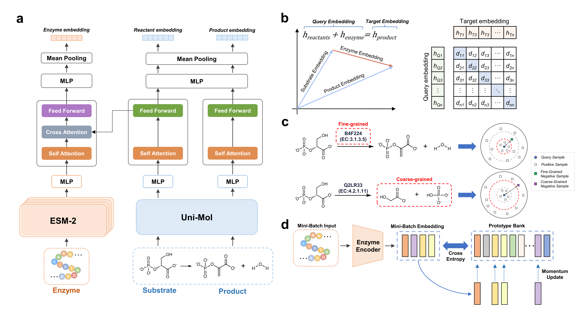

# Dual-Grained Cross-Modal Molecular Representation Learning for Enzymatic Reaction Modeling
 <br>
Implementation of A Dual-Grained Molecular Learning Approach Integrating Knowledge Graphs and Contrastive Learning<br>



## Table of contents

- [Introduction](#introduction)
- [Prerequisites](#prerequisites)
- [Setup Environment](#setup-environment)
  - [Clone the repository to your local machine](#clone-the-repository-to-your-local-machine)
  - [Install the environment](#install-the-environment)

- [Reproduce Results](#reproduce-results)

  - [Data process](#data-process)
  - [Training the model](#training-the-model)
  - [Substrate prediction](#substrate-prediction)
  - [Site prediction](#site-prediction)


## Introduction

We introduce a dual-grained , cross-modal enzymatic-reaction-aware molecular learning method named ERAM which is capable of (i) simultaneously predicting the feasibility and the ideal enzymes for a given reaction (and vice versa), by a dual-grained contrastive learning scheme, (ii) capturing the catalytic interactions between the substrates and the enzyme via a joint cross-modal modeling of their individual representations.

## Prerequisites
* Python (version >= 3.10) 
* PyTorch (version >= 2.0.1) 
* RDKit (version >= 2023.9.5)
* fair-esm (version == 2.0.0)
* lmdb 
* loguru 
* scikit-learn (version >= 1.3.2)
* unimol-tools(version == 1.0.0)
* unicore(version == 0.0.1)
* transformers(version >= 4.44.2)

## Setup Environment

### Clone the repository to your local machine

```
git clone https://github.com/YuanshengH/Dual-Enzy.git
```

### Install the environment

```
conda create -n ERAM python=3.10
conda activate ERAM
cd Dual-Enzy
pip install -r requirement.txt
```

## Reproduce Results

### Data Download
Before reproducing the results, please download the model checkpoint and data. You can find them [here](https://drive.google.com/file/d/1o-i4cl2u5j6cL5RDbutAeoQTuZxpD6ND/view?usp=sharing "download").

### Data process

```
python dataprocess.py --task data_process --data_path ./data/rhea_data.csv
python dataprocess.py --task unimol --data_path ./data/rhea_processed_data.csv
python dataprocess.py --task esm_extract --data_path ./data/rhea_processed_data.csv
python ./feature_bank_init.py
```

### Training the model
```
torchrun --nproc_per_node {num_GPU} train_ddp.py --batch_size 64 --wandb_api_key {wandb_api_key}
``` 

### Reaction Retrieval
To evaluate reaction retrieval task, execute the following commands in your terminal:
```
python ./reaction_retrieval.py
```

### Substrate prediction
#### [1] Nitrilase substrate prediction
To proceed with the prediction, first place the file `nitrilase_data.csv` into the directory `./data/nitrilase_dataset`. Then execute the following commands in your terminal:
```
python ./nitrilase_data_process.py
python ./nitrilase_match.py
```

#### [2] Aminotransferase substrate prediction
To proceed with the prediction, first place the file `aminotransferase_data.csv` and `aminotransferase_sequence_file.txt` into the directory `./data/aminotransferase_dataset`. Then execute the following commands in your terminal:
```
python ./aminotransferase_data_process.py
python ./aminotransferase_match.py
```

### Site prediction
To proceed with the prediction, first place the file `rxnaamapper.csv` into the directory `./data/site_pred_data`. Then execute the following commands in your terminal:
```
python ./site_pred_rxnaamapper.py
```